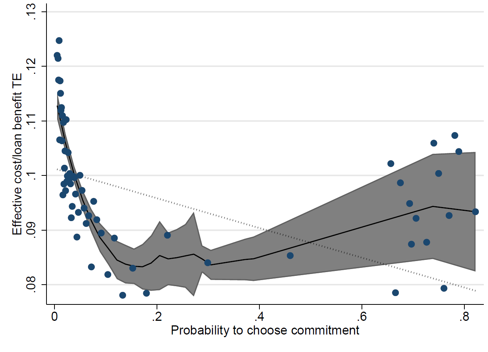

# Machine Learning en Inferencia Causal

Los métodos de ML nos han ayudado a construir modelos estadísticos más granulares. 

La estimación de *Efectos Heterogéneos* es fundamental en diversos problemas estadísticos modernos. 

- Medicina Personalizada
- Marketing Personalizado
- Fairness en ML
- Evaluación de políticas

El objetivo será la estimación de
$$\mathbb{E}[\tau_i \;|\; X_i = x]$$
donde $\tau_i$ será el efecp de tratamiento individual.


## Framework

Consideramos una tupla $(X_i, Y_i, W_i)$ que consisten en

- Vector de observables $X_i\in \mathbb{R}^p$
- Variable de respuesta $Y_i\in \mathbb{R}$
- Asignación de tratamiento $W_i\in\{0,1\}$

Siguiendo la estructura de **observaciones potenciales**, suponemos que existe el par de observaciones potenciales para cada individuo: $(Y_i(1), Y_i(0))$, pero sólo observamos $Y_i = Y_i(W_i)$ 

Definimos el efecto de tratamiento individual como 
$$\tau_i := Y_i(1)-Y_i(0)$$

sin embargo, el principal problema es que la función objetivo es no factible: 
$$\sum_i (\tau_i-\hat\tau(X_i))^2$$

por lo que "off-the-shelf ML methods" no son directamente aplicables.

Buscamos en lugar estimar el CATE
$$\tau(x) = \mathbb{E}[Y(1)-Y(0) \;|\; X=x]$$

Todos los métodos de ML (@cate_ml) (@ai_ml) para estimar efectos heterogéneos se concentrarán en la estimación del CATE.


Sin mayores supuestos no podemos estimar $\tau(x)$, por lo que suponemos:

#### Unconfoundedness
 $$\{Y_i(0), Y_i(1)\} \perp W_i\; | X_i$$
 

## Causal Trees

Seguiremos las ideas presentadas en @athey_imbens.


En el contexto usual de predicción de variables de respuesta, nos interesa minimizar el error cuadrático medio (MSE).

Construimos un estimador para la media condicional, dada una muestra $S$:

$$ \hat{\mu}(x, S, \Pi) = \frac{1}{\# (i\in S \; :\; X_i\in\ell(x, \Pi))}\sum_{i\in S\;; X_i\in \ell(x,\Pi)} Y_i$$

donde $\Pi$ es un algoritmo para la construcción de un árbol, $\ell(x,\Pi)$ es la hoja del árbol $\Pi$ tal que $x\in \ell$.

El MSE es el error medio entre la variable respuesta y el ajuste según la función $\hat\mu$:

$$MSE_\mu(S^{te}, S^{est}, \Pi) = \frac{1}{\# (S^{te})}\sum_{i\in S^{te}}\{(Y_i-\hat\mu(X_i, S^{est}, \Pi))^2-Y_i^2\}$$
Notemos que se hace una partición de la muestra en $S^{te}$ una muestra de prueba y $S^{est}$ una muestra de estimación- en donde se ajusta la media condicional según el árbol $\Pi$.


Nuestra función objetivo a minimizar es 
$$Q(\pi) = EMSE_\mu(\pi(S^{est})) = \mathbb{E}_{S^{te}, S^{est}, S^{est}}[MSE_\mu(S^{te}, S^{est}, \pi(S^{est}))]$$ 

Un estimador insesgado para el $EMSE_\mu(\Pi)$
$$-\widehat{EMSE}_\mu(S^{tr}, N^{est}, \Pi) = \frac{1}{N^{tr}} \sum_{i\in S^{tr}} \hat{\mu}^2(X_i, S^{tr}, \Pi) - \left(\frac{1}{N^{tr}}+\frac{1}{N^{est}}\right)\sum_{\ell\in\Pi}S^2_{S^{tr}}(\ell(x,\Pi))$$
donde $S^2_{S^{tr}}$ es la varianza dentro de las hojas del árbol y $N$ denota el tamaño de muestra.


## Modificación para estimar el CATE

Recordemos que queremos estimar el CATE, por lo que tenemos que hacer diversas modificaciones. Claramente no podemos considerar el MSE

$$MSE_\tau(S^{te}, S^{est}, \Pi) = \frac{1}{\# (S^{te})}\sum_{i\in S^{te}}\{(\tau_i-\hat\tau(X_i, S^{est}, \Pi))^2-\tau_i^2\}$$
pues es infactible.

La primera modificación del paper es considerar una función objetivo *honesta* 
$$Q(\pi)^{H} = \mathbb{E}_{S^{te}, S^{est}, S^{tr}}[MSE_\tau(S^{te}, S^{est}, \pi(S^{tr}))]$$ 

En esencia se particiona la muestra en tres submuestras. Se construye el árbol en $S^{tr}$ (según ) $\pi(S^{tr})$, luego el estimador de la media condicional en $S^{est}$ y se calcula el error en $S^{tr}$. Esto se conoce como **estimación honesta**.

Ahora, la estimación del EMSE es

$$-\widehat{EMSE}_\tau(S^{tr}, N^{est}, \Pi) = \frac{1}{N^{tr}} \sum_{i\in S^{tr}} \hat{\tau}^2(X_i, S^{tr}, \Pi) - \left(\frac{1}{N^{tr}}+\frac{1}{N^{est}}\right)\sum_{\ell\in\Pi}\left\{\frac{S^2_{S^{tr}_{treat}}(\ell(x,\Pi))}{p}+\frac{S^2_{S^{tr}_{treat}}(\ell(x,\Pi))}{1-p}\right\}$$
con $p$ la proporción de tratamiento. 

# Aplicación: Private paternalism. Who benefits more from being forced to paternalism?

Para ejemplificar, consideraremos un [experimento](http://www.enriqueseira.com/uploads/3/1/5/9/31599787/the_limits_of_self-commitment_and_private_paternalism.pdf) en donde se aleatorizó el tipo de contrato en un contexto de microcréditos. La hipótesis a probar es que forzando a la gente a un esquema de pago frecuente con penalidad, aumenta el beneficio económico (*eff_cost_loan*), y disminuye la taza de default. 

A el grupo de tratamiento se le ofrece un contrato con pagos cada 30 días y duración del término de 90 días, con una penalidad si fallan el pago; mientras que el grupo control tiene 90 días para pagar.

¿Para qué queremos saber los efectos heterogéneos? 

1. En este caso queremos saber quiénes se benefician más de ser forzados a un esquema de pago frecuente. 

2. En otro brazo de tratamiento a las personas se les dió la opción de elegir alguno de los contratos. Nos gustaría conocer si quienes demandan *commitment* son los más beneficiados.

El comando para los árboles causales es <code>causalTree</code> de la librería <code>causalTree</code>.

```{r}
library(tidyverse)
library(causalTree)
library(rattle)

# SET WORKING DIRECTORY
setwd('C:/Users/isaac/Dropbox/Apps/ShareLaTeX/metodos_estadisticos/Rscripts')
set.seed(5289374)


data_in <- read_csv('./eff_te_heterogeneity.csv') %>%
  mutate_all(~ifelse(is.na(.), median(., na.rm = TRUE), .))  

require("dplyr")

# Train model in experimental data
data_train <- data_in %>% 
  filter(insample == 1) 

data_test <- data_in %>% 
  select(-c(eff_cost_loan, fee_arms, prenda, insample))

# Causal Tree
tree <- causalTree(eff_cost_loan ~ . -fee_arms-prenda-insample , data = data_train, treatment = data_train$fee_arms,
                   split.Rule = "CT", cv.option = "CT", split.Honest = T, cv.Honest = T, split.Bucket = F, 
                   xval = 5, cp = 0, minsize = 20, propensity = 0.5)
opcp <- tree$cptable[,1][which.min(tree$cptable[,4])]
opfit <- prune(tree, opcp)
fancyRpartPlot(opfit,  palettes=c("Blues", "BuGn"), sub="") 
```

vemos que hay cierta heterogeneidad en las distintas hojas del árbol, y en promedio un efecto positivo del tratamiento. Esto ayuda a responder la pregunta 1. de arriba. 


# De árboles casuales a bosques causales

Dado un árbol como predictor
$$ \hat\tau(x) = T(x; \{X_i,Y_i,W_i\}) $$
podemos construir y promediar distintos árboles $T^*$

$$ \hat\tau(x) = \frac{1}{B} \sum_{b=1}^B T_b^*(x; \{X_i,Y_i,W_i\})$$
Convertimos $T$ a $T^*$ a partir de *Bagging*, esto además ayuda a suavizar discontinuidades. 

El resultado principal de @athey_wager es que los bosques son asintóticamente Gaussianos, lo que nos permite hacer inferencia sobre las estimaciones. El comando para los bosques causales es <code>causal_forest</code> de la librería <code>grf</code>


```{r}
library(grf)
library(ggplot2)
library(ggthemes)


# PREPARE VARIABLES
X <- select(data_train,-c(eff_cost_loan, fee_arms, prenda, insample))
Y <- select(data_train,eff_cost_loan)
W <- as.numeric(data_train$fee_arms == 1)

###################################################################  
###################################################################  


# OVERLAP ASSUMPTION
propensity.forest = regression_forest(X, W)
propensity_score = predict(propensity.forest)$predictions
propensity_score[propensity_score==1] <- 0.99
propensity_score[propensity_score==0] <- 0.01
hist(propensity_score, xlab = "propensity score")
```


Vemos que el supuesto de *overlap* falla, ya que tenemos valores muy cercanos a $0$ y $1$, lo que indica que dadas las covariables podemos predecir la asignación de tratamiento. Una forma para corregir esto es recortar a los individuos con propensity score cercanos a $0$ o $1$, como lo sugiere @chim

Nota: Otra prueba de diagnóstico antes de hacer cualquier estimación es verificar balance en observables.


```{r}
# Dropping observations with extreme values of the propensity score - CHIM (2009)
g <- 1/(propensity_score*(1-propensity_score))

# One finds the smallest value of \alpha\in [0,0.5] s.t.
# $\lambda:=\frac{1}{\alpha(1-\alpha)}$
# $2\frac{\sum 1(g(X)\leq\lambda)*g(X)}{\sum 1(g(X)\leq\lambda)}-\lambda\geq 0$
# 
# Equivalently the first value of alpha (in increasing order) such that the constraint is achieved by equality
# (as the constraint is a monotone increasing function in alpha)

fun_threshold_alpha = function(alpha, g) {
  lambda = 1/(alpha*(1-alpha))
  ind = (g<=lambda)
  den = sum(ind)
  num = ind*g
  return((2*sum(num)/den-lambda)^2)
}

alfa = optimize(fun_threshold_alpha, g, interval=c(0.001, 0.49))$minimum

hist(propensity_score[propensity_score>=alfa & propensity_score<=(1-alfa)], xlab = "propensity score")


X <- X[propensity_score>=alfa & propensity_score<=(1-alfa),]
Y <- Y[propensity_score>=alfa & propensity_score<=(1-alfa),]
W <- W[propensity_score>=alfa & propensity_score<=(1-alfa)]

```

Ahora si estimamos nuestro bosque :

```{r}
# ESTIMATE MODEL


# Causal Forest
tau.forest = causal_forest(
  X = model.matrix(~., data = X), 
  Y = data.matrix(Y), 
  W = W,
  Y.hat = NULL,
  W.hat = NULL,
  num.trees = 2000,
  sample.weights = NULL,
  clusters = NULL,
  equalize.cluster.weights = FALSE,
  sample.fraction = 0.5,
  mtry = min(ceiling(sqrt(ncol(X)) + 20), ncol(X)),
  min.node.size = 5,
  honesty = TRUE,
  honesty.fraction = 0.5,
  honesty.prune.leaves = TRUE,
  alpha = 0.05,
  imbalance.penalty = 0,
  stabilize.splits = TRUE,
  ci.group.size = 2,
  tune.parameters = "none",
  tune.num.trees = 200,
  tune.num.reps = 50,
  tune.num.draws = 1000,
  compute.oob.predictions = TRUE,
  num.threads = NULL,
  seed = runif(1, 0, .Machine$integer.max))

# Estimate treatment effects for the training data using out-of-bag prediction.
tau_hat_oob = predict(tau.forest, model.matrix(~., data = data_test), estimate.variance = TRUE)
hist(tau_hat_oob$predictions)

```


Vemos que hay heterogeneidad en el efecto de tratamiento, además que la mayoría de la población es beneficiada.


```{r}
# Estimate the conditional average treatment effect on the full sample (CATE).
sprintf("Target sample (All). CATE : %f  SE : %f" , 
        average_treatment_effect(tau.forest, target.sample = "all", method = "AIPW")[1],
        average_treatment_effect(tau.forest, target.sample = "all", method = "AIPW")[2])
sprintf("Target sample (Overlap). CATE : %f  SE : %f", 
      average_treatment_effect(tau.forest, target.sample = "overlap", method = "AIPW")[1],
      average_treatment_effect(tau.forest, target.sample = "overlap", method = "AIPW")[2])
```
```{r}
# Estimate the conditional average treatment effect on the treated sample (CATT).
# Here, we don't expect much difference between the CATE and the CATT, since
# treatment assignment was randomized.
sprintf("Target sample (Treated). CATT : %f  SE : %f", 
      average_treatment_effect(tau.forest, target.sample = "treated", method = "AIPW")[1],
      average_treatment_effect(tau.forest, target.sample = "treated", method = "AIPW")[2])
```
```{r}
# The (conditional) average treatment effect on the controls 
sprintf("Target sample (Control). CATC : %f  SE : %f",
      average_treatment_effect(tau.forest, target.sample = "control", method = "AIPW")[1],
      average_treatment_effect(tau.forest, target.sample = "control", method = "AIPW")[2])
```


# Analyzing the model

Nos interesa (para responder la pregunta 1.) conocer cuáles son las variables que predicen mejor el efecto heterogéneo, y su "efecto parcial". 

```{r}
# Variable importance
var_imp <- variable_importance(tau.forest)
var_imp <- data.frame(var_imp[2:length(var_imp)])
var_imp <- cbind(var_imp, colnames(X))
colnames(var_imp) <- c("Variable Importance", "Variable")
ggplot(var_imp, mapping = aes(x = `Variable Importance`, y = Variable)) +
  geom_point() +
  xlab("Variable Importance") + 
  ylab("Variable") +
  theme_few()
```

Nos gustaría conocer el "efecto parcial" de las observables con el CATE. En esencia lo que estamos estimando es

$$CATE_i = \alpha + \beta Variable_{i,j} +\epsilon_i$$
Nota :  No corremos exactamente el modelo lineal de arriba, sino sobre predicciones *doblemente robustas* del CATE: 

$$\text{Predicciones doblemente rob. del CATE}_i = \alpha + \beta Variable_{i,j} +\epsilon_i$$


```{r}
# Best linear projection of the conditional average treatment effect on covariates
best_linear_projection(tau.forest, X)


```

Por último hacemos una prueba de correcta especificación del bosque y existencia de heterogeneidad.

$$\begin{equation}
Y_{i} - \hat{m}^{-i}(X_{i}) = \alpha\bar{\tau}\left(W_{i} - \hat{e}^{-i}(X_{i})\right) + \beta \left(\hat{\tau}^{-i}(X_{i}) - \bar{\tau} \right) \left(W_{i} - \hat{e}^{-i}(X_{i}) \right) + \epsilon,
\end{equation}$$
donde $\bar{\tau} := n^{-1}\sum_{i=1}^{n} \hat{\tau}^{-i}(X_{i})$.

Los coeficientes $\alpha$ y $\beta$ nos permiten evaluar el desempeño de nuestras estimaciones. Si $\alpha=1$, entonces la predicción promedio producida por el bosque es correcta. Mientras tanto, si $\beta=1$, entonces las predicciones del bosque capturan adecuadamente la heterogeneidad subyacente.

La pendiente $\beta$ es una medida de cómo las predicciones del CATE covarían con el verdadero CATE. Por lo tanto, el p-value en la estimación del coeficiente también actúa como una prueba para la presencia de heterogeneidad. Si el coeficiente es significativamente mayor que cero, entonces podemos rechazar la nula de no heterogeneidad. Sin embargo, los coeficientes menores que 0 no son significativos y no se pueden interpretar.


```{r}
# Assessing heterogeneity

# Computes the best linear fit of the target estimand using the forest prediction 
# (on held-out data) as well as the mean forest prediction as the sole two regressors.
# A coefficient of 1 for 'mean.forest.prediction' suggests that the mean forest 
# prediction is correct, whereas a coefficient of 1 for 'differential.forest.prediction'
# additionally suggests that the forest has captured heterogeneity in the underlying signal. 

test_calibration(tau.forest)

```

Finalmente obtenemos las predicciones de los efectos de tratamiento, si forzaramos a todos los individuos al grupo de tratamiento. Asimismo calculamos la probabilidad de escoger el contrato de pago frecuente, y nos preguntamos sobre la relación del efecto heterogéneo con la propensión a escoger el contrato de pago frecuente. 




Esto responde nuestro punto 2. : Se benefician más las personas que NO eligen el contrato de pago frecuente. El punchline es que **"private paternalism" es benéfico para personas hiperbólicas naive.**


## Referencias


